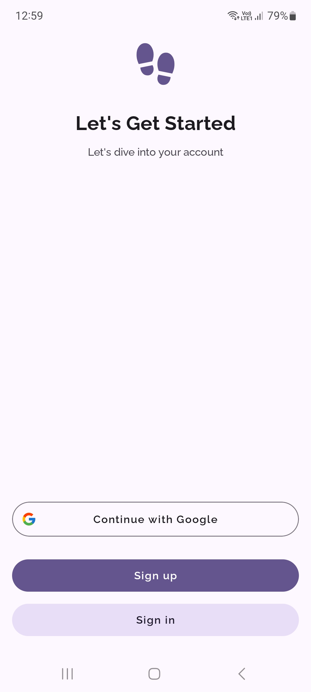
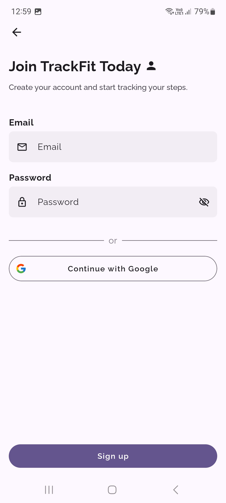

# TrackFit

This app was built using Kotlin Multiplatform Compose. The program itself is built on a multi-module architecture and uses the following technological solutions:

* Gradle convention plugin.
* Firebase for store and sync user data.
* Integration with Google SignIn.
* Multi modular.
* Foreground Service with custom notification.
* Google Map.
* Dark/Light Theme.
* Multiple locales support.

You can download the Android APK file from [this link.](https://github.com/Mark159753/TrackFit-KMP-Compose-/tree/main/media/app-release.apk)

## Setup Instructions

To build the project, please follow these steps:

1. Create new Firebase project.
2. Get your own Firebase google-services.json file and [place file into app module](https://github.com/Mark159753/TrackFit-KMP-Compose-/tree/main/app)
3. Get your own Firebase GoogleService-Info.plist file for ios and [place file into ios module](https://github.com/Mark159753/TrackFit-KMP-Compose-/tree/main/iosApp/iosApp)
4. Set your google map api key into android [manifest](https://github.com/Mark159753/TrackFit-KMP-Compose-/blob/main/app/src/androidMain/AndroidManifest.xml)
5. Set your google map API key in [AppDelegate](https://github.com/Mark159753/TrackFit-KMP-Compose-/blob/main/iosApp/iosApp/iOSApp.swift)
6. Update IOS [Info.plist](https://github.com/Mark159753/TrackFit-KMP-Compose-/blob/main/iosApp/iosApp/Info.plist) file, replace YOUR_FIREBASE_CLIENT_ID with your Firebase client id.
7. Create a file named `secrets.properties` in the root directory of the project.
8. Add the following fields to the `secrets.properties` file:

   ```properties
   WEB_CLIENT_ID=your_web_client_id
   MAPS_API_KEY=your_google_map_api_key

# Screenshots

https://github.com/user-attachments/assets/447ba91d-c675-4252-a501-b231e347bf9d

</img>
</img>

| Android App Screenshots   | iOS App Screenshots   |
|---------------------------|-----------------------|
|  |  |
|  |  |
|  |  |
|  |  |
|  |  |
